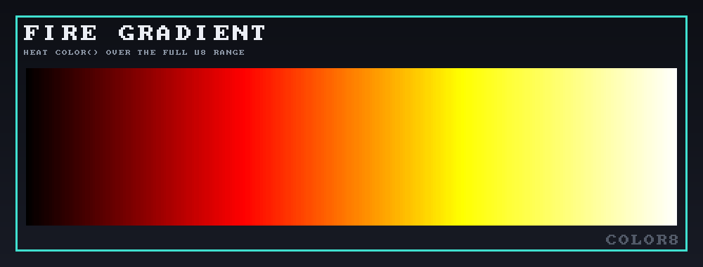
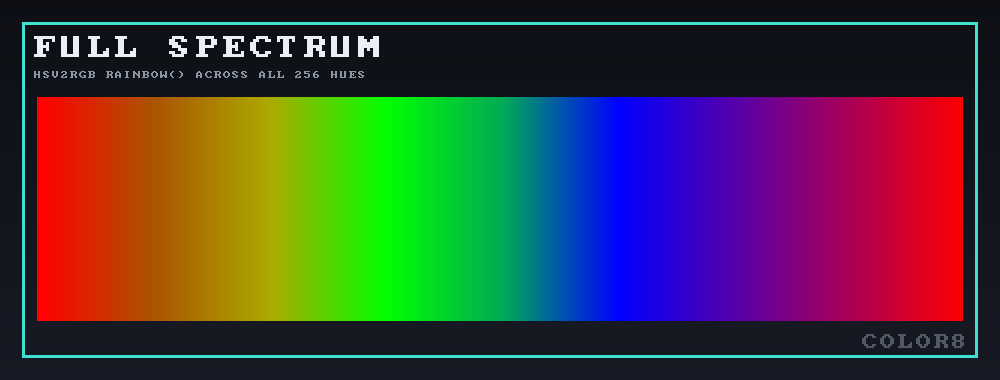
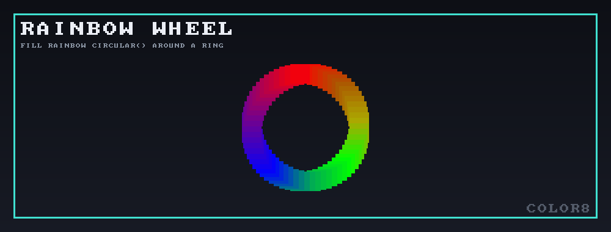
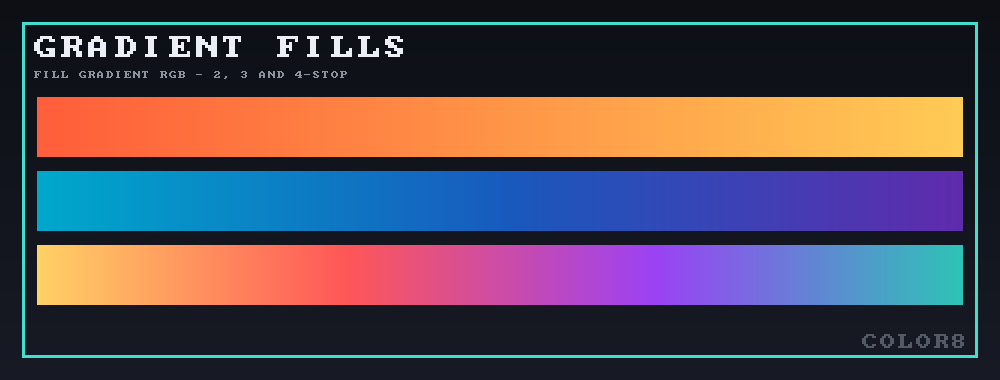
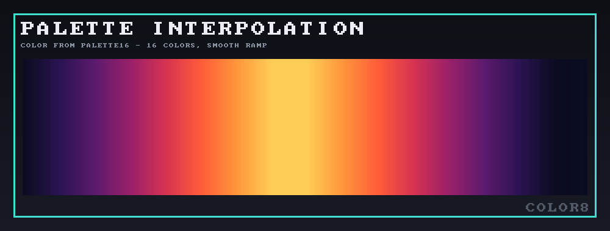
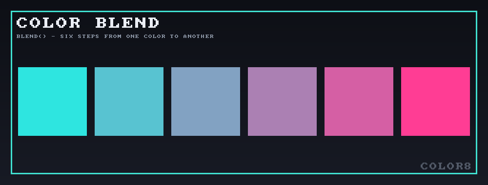

# color8

A `no_std`, `#![forbid(unsafe_code)]` Rust port of [FastLED](https://github.com/FastLED/FastLED)'s
`colorutils`: the `CRGB`/`CHSV` pixel types, HSV↔RGB conversion, and the
array fill/gradient helpers that FastLED's effects are built on.

Built on [`lib8tion`](https://github.com/orhanbalci/lib8tion) for the
underlying fixed-point 8-bit math.

## Gallery

Each image is generated by a runnable example — `cargo run --example
<name>`, output lands in `../gallery/`. Source in
[`examples/`](examples/); shared canvas/font code in
[`examples/support/`](examples/support/).

<p align="center">
  <br>
  <code>cargo run --example heat_sweep</code> — <a href="src/heat.rs"><code>heat_color</code></a> over the full <code>u8</code> range.
</p>

<p align="center">
  <br>
  <code>cargo run --example rainbow_sweep</code> — <a href="src/hsv.rs"><code>hsv2rgb_rainbow</code></a> across all 256 hues.
</p>

<p align="center">
  <br>
  <code>cargo run --example rainbow_wheel</code> — <a href="src/fill.rs"><code>fill_rainbow_circular</code></a>, one turn spread over a ring.
</p>

<p align="center">
  <br>
  <code>cargo run --example gradient_fills</code> — 2/3/4-stop <a href="src/fill.rs"><code>fill_gradient_rgb</code></a>/<code>fill_gradient_rgb3</code>/<code>fill_gradient_rgb4</code>.
</p>

<p align="center">
  <br>
  <code>cargo run --example palette_blend</code> — <a href="src/palette.rs"><code>color_from_palette16</code></a>, 16 colors interpolated smoothly.
</p>

<p align="center">
  <br>
  <code>cargo run --example crossfade</code> — <a href="src/blend.rs"><code>blend</code></a> at six steps between two colors.
</p>

## Which FastLED?

The port targets **FastLED 3.6.0** — the last release before upstream moved
everything into the `fl::` namespace and split `colorutils.cpp` apart. Where
that release has known quirks (the `rgb2hsv_approximate` orange/yellow hue
wraparound, FastLED#436; the truncated gradient delta that undershoots the
end color on long ramps), they are **reproduced, not corrected**: this is a
byte-exact port, and the differential suite pins the quirks in place so a
well-meaning future "fix" can't silently diverge.

## Status

| Area | Ported | Validation |
|---|---|---|
| `Crgb` + arithmetic/scaling operators | ✅ | exhaustive vs. C |
| `Chsv`, `HsvHue` | ✅ | — |
| `hsv2rgb_rainbow` | ✅ | all 2²⁴ inputs |
| `hsv2rgb_spectrum` | ✅ | all 2²⁴ inputs |
| `rgb2hsv_approximate` | ✅ | all 2²⁴ inputs |
| `fill_solid`, `fill_rainbow`, `fill_rainbow_circular` | ✅ | properties |
| `fill_gradient_rgb` (2/3/4-stop, + range) | ✅ | vs. C across lengths |
| `fill_gradient` HSV (2/3/4-stop, + direction) | ✅ | properties |
| `blend`/`nblend` (RGB + HSV directional, scalar + slice) | ✅ | exhaustive vs. C |
| `fadeUsingColor`, `fade_video`/`fade_raw`/`nscale8_raw` | ✅ | exhaustive vs. C |
| `HeatColor` | ✅ | exhaustive vs. C |
| Palettes (CRGB/CHSV × 16/32/256) + `ColorFromPalette` | ✅ | exhaustive index/brightness/blend vs. C, sampled palette content |
| Gradient-palette format, `fill_palette*`, presets | ⬜ | — |
| `blur1d` | ⬜ | — |
| `blur2d` | ⬜ | needs an `XY` mapping abstraction |
| gamma + color-correction constants | ⬜ | needs a `pow` strategy |

Not yet ported from `CRGB`: ordering operators, `getLuma`/`getAverageLight`,
`maximizeBrightness`, `lerp8`/`lerp16`, `getParity`/`setParity`, and the
packed-`u32` color-code round trip.

## Deliberate deviations

FastLED takes a raw pointer plus a count; these take a `&mut [T]` and fill it
end to end. Where FastLED computes `numLeds - 1` and underflows on an empty
array — running off the end of a 65535-iteration loop — these functions
return without writing. That is the only intentional behavioral difference,
and it trades undefined behavior for a no-op.

## Testing

```sh
cargo test --release
```

Two suites:

- **`tests/differential.rs`** — links against `fastled-ref`, a vendored C
  transcription of FastLED 3.6.0 (test-only, `path` dependency,
  `publish = false`), and compares output bit-for-bit. The three HSV
  conversions are swept over their *entire* 2²⁴ input domain; the `Crgb`
  operators are swept so that every channel sees every `(lhs, rhs)` byte
  pair.
- **`tests/properties.rs`** — `proptest` coverage for the array-shaped
  `fill_*` functions (whose input space is length × colors × direction, so
  not exhaustively sweepable), plus algebraic invariants that must hold by
  construction and would catch a transcription error that slipped through
  *both* sides of a differential check.

Use `--release`: the exhaustive sweeps are ~70M iterations and are slow in a
debug build.

## `no_std` targets

```sh
cargo build --lib --target thumbv7em-none-eabihf
cargo build --lib --target riscv32imc-unknown-none-elf
```
